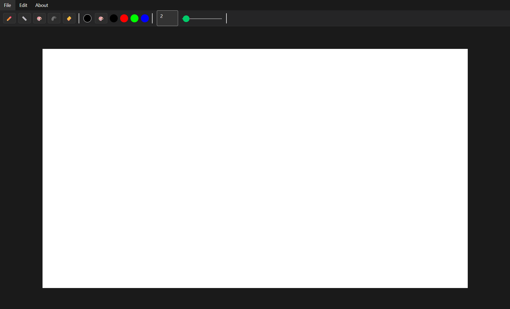

# ICGPaint - графический редактор

Простой аналог Microsoft Paint с базовыми и продвинутыми инструментами для рисования.  
Разработан с целью практики программирования графических интерфейсов.

 <!-- Замените на реальный скриншот -->

## 🎨 Возможности

### Инструменты
- **Карандаш**: Рисование произвольных линий
- **Линии**: Прямые линии между двумя точками
- **Фигуры**: 
  - Многоугольник
  - Звезда
- **Заливка**: Закрашивание замкнутых областей
- **Ластик**: Стирание всего холста

### Дополнительные функции
- � Выбор цвета из палитры (RGB/HEX)
- 📏 Регулировка толщины линий (1-50px)
- 💾 Сохранение проекта в формате PNG/JPG
- 📂 Загрузка изображений для редактирования
- 🧹 Очистка холста

## ⚙️ Требования
- .NET Framework 8.0

## 🛠 Сборка и запуск

1. Клонируйте репозиторий:
```bash
git clone https://github.com/MotorinIlya/ICGPaint.git
```
2. запустите из под папки src:
```bash
dotnet run
```